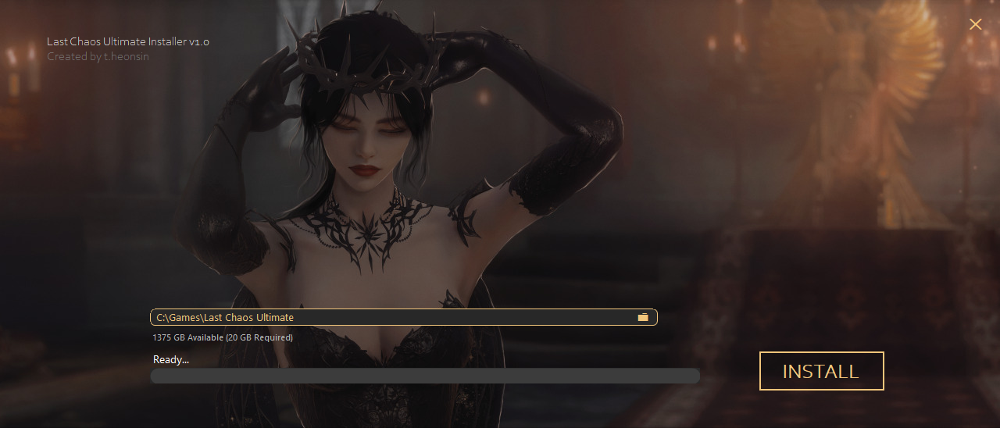
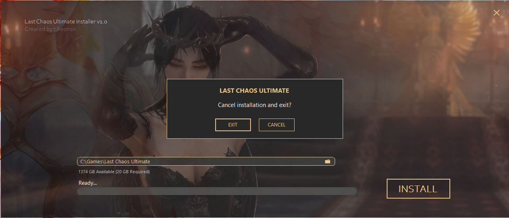

# Ultimate Setup

Modern installer for Last Chaos Ultimate.

## Features

- Modern custom UI
- Automatic game download
- Archive extraction
- Free disk space validation
- Existing installation detection
- Smooth progress animations
- Automatic launcher start after installation
- Custom borderless design

## Screenshots

### Main Window

### Exit Confirmation

---

## Requirements

- Windows 10 / 11
- Internet connection
- 20 GB free disk space

---

## Technologies

- C#
- .NET 8
- Windows Forms
- HttpClient
- ZIP Archive API

---

## Author

Created by **t.heonsin**

GitHub:
https://github.com/theonsin

---

## License

This project is intended for use with Last Chaos Ultimate.
